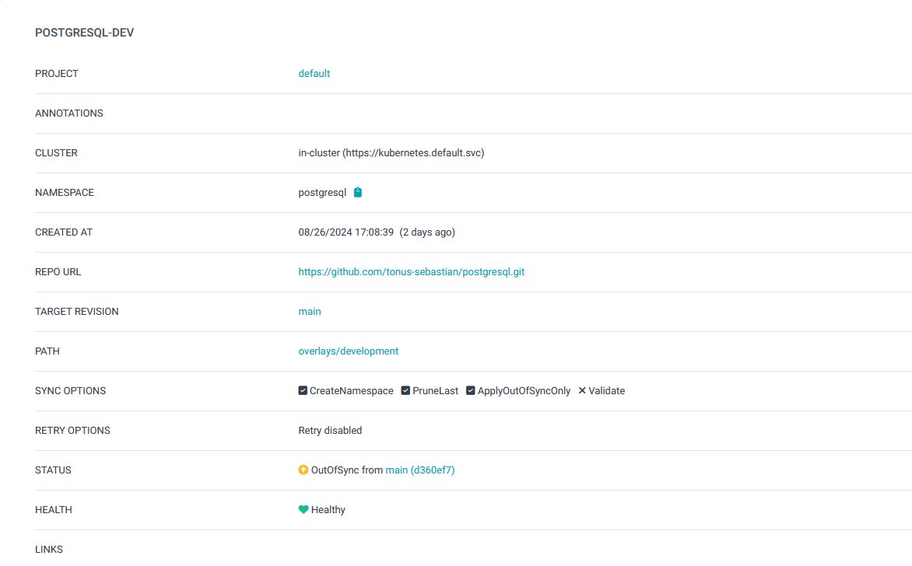

# Running PostgreSQL in OKD With Kustomize+ArgoCD
`git clone https://github.com/tonus-sebastian/postgresql.git`

```
├── README.md
├── base
│   ├── deployment.yaml
│   ├── kustomization.yaml
│   └── secret.yaml
└── overlays
    ├── development
    │   ├── deployment.yaml
    │   ├── kustomization.yaml
    │   ├── nodeport.yaml
    │   └── secret.yaml
    └── production

```
## Apply Kustomize in ArgoCD
deploy with argo UI and you see detail in below 
